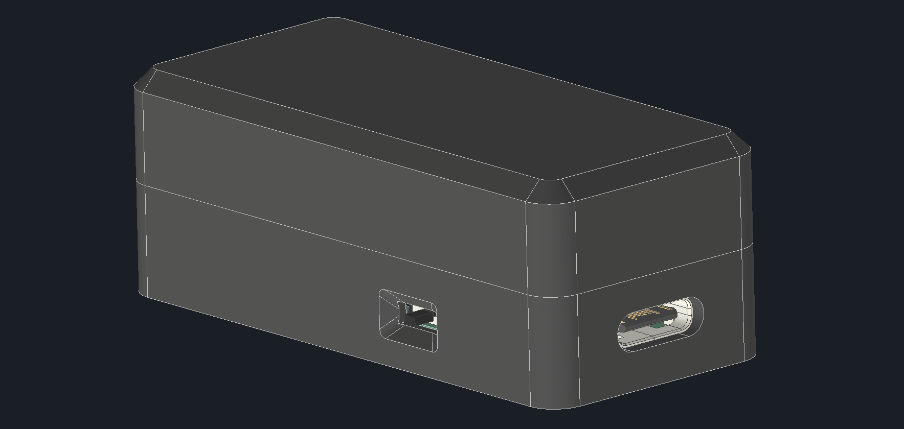
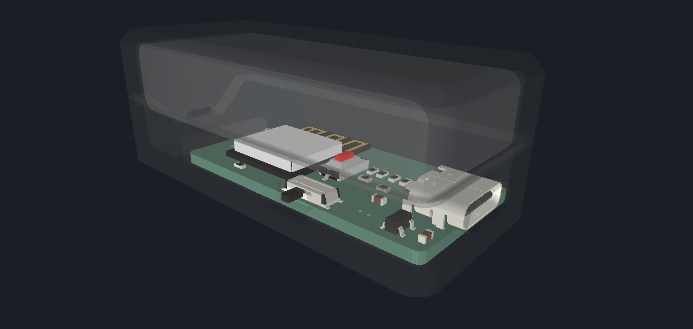

# Wearable WLED Mechanical

[← Back to main repository](https://github.com/MiCyg/WearableWLED.git)

---

The enclosure for the Wearable WLED device, designed for 3D printing and easy assembly. Currently split into two shell halves connected at the top for straightforward printing and assembly.

## Files

- `case1.ipt` — Top half of the enclosure
- `case2.ipt` — Bottom half of the enclosure
- `main.iam` — Full assembly file showing the complete enclosure

	
	

